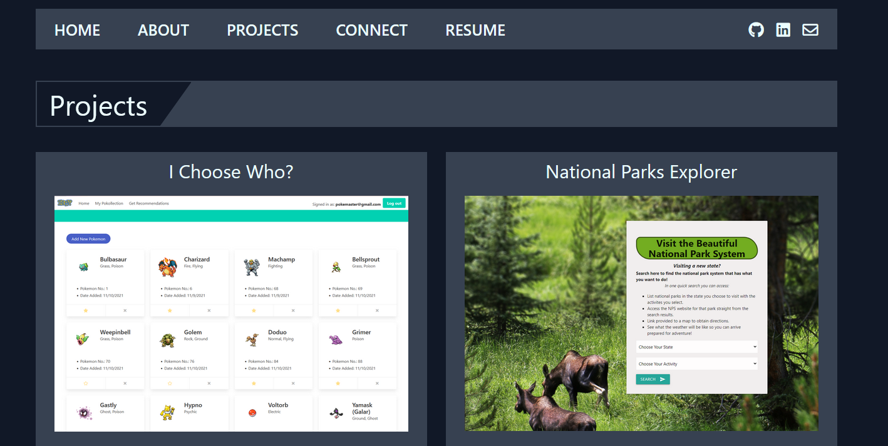
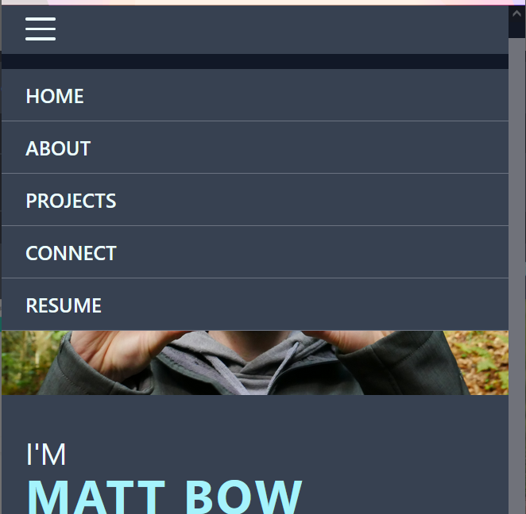

# React Portfolio

## Description

This is a rebuild of my professional portfolio utilizing React and create-react-app. The content is primarily the same but uses React's components along with hooks for basic form handling (since there is no back-end yet, the form is non-functional).

## Installation

To install a version for yourself, fork the repo and create a local copy. Then run:

    npm install

This will install React, Tailwind CSS, and their associated dependencies.

## Usage

The basic structure is identical to my previous portfolio (https://mdbow22.github.io/devPortfolio) but utilizes components, and conditional rendering to make it feel like a multi-page site. The site is also mobile-first and responsive.

Desktop view of Projects section:

Mobile view with menu open:

## Questions

Please send any questions through my gitHub profile: mdbow22.

## Demo

A demo is at https://mdbow22.github.io/react-portfolio.